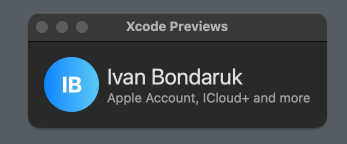

# Person Initials Avatar


**PersonInitialsAvatar** is a SwiftUI component that displays a clean text avatar. Easily customizable and perfect for apps that want to present contact or professional information in a stylish way.

## ✨ Features

- Simple design
- SwiftUI-native
- Fully customizable: full name, size and background color
- Works on both iOS and macOS
- Lightweight and dependency-free

## 🛠 Installation

### 📦 Swift Package Manager (SPM)

You can add this package directly through **Xcode**:

1. Open your project in Xcode.
2. Go to **File > Add Packages...**
3. Enter the URL of the repository: [https://github.com/Ivan-Bondaruk/ProfessionalCard](https://github.com/Ivan-Bondaruk/PersonInitialsAvatar)
4. Select version `1.0.2` or **Up to Next Major**.
5. Click **Add Package**.

That's it! The package is now ready to use in your SwiftUI project.

## 💻 Requirements

- iOS 13.0+ / macOS 13.0+
- Xcode 16
- Swift 6.1
- SwiftUI framework

## Screenshot


- Package include only AvatarView not more like text on screenshot
## 🧩 Usage

```swift
import PersonInitialAvatar

PersonInitialsAvatarView(fullName: "Ivan Bondaruk", diameter: 100)
// OR
PersonInitialsAvatarView(fullName: "Ivan Bondaruk", diameter: 100, backgroundColor: .secondary)

// For gradient background use another view
ProfessionalPersonInitialAvatarView(fullName: "Ivan Bondaruk", diameter: 100, gradientColors: [.purple, .secondary])
// OR
ProfessionalPersonInitialAvatarView(fullName: "Ivan Bondaruk", diameter: 100)
